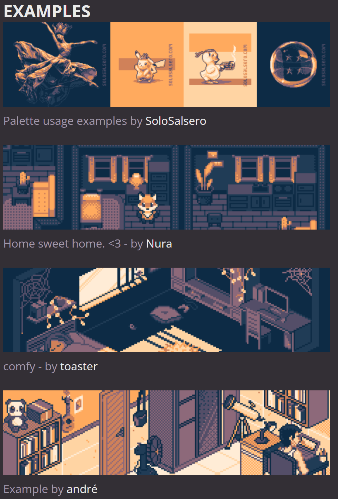
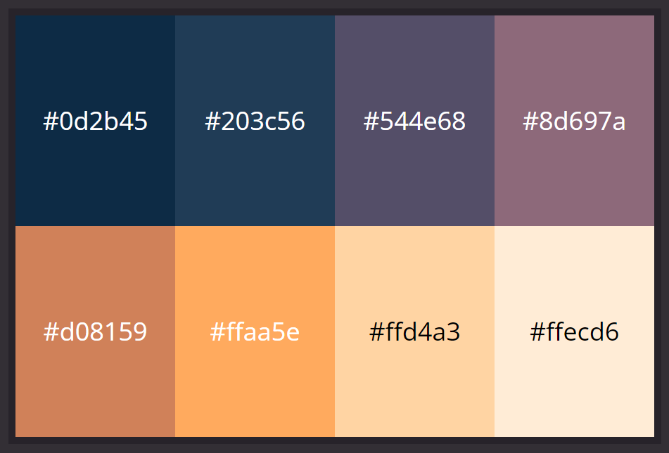
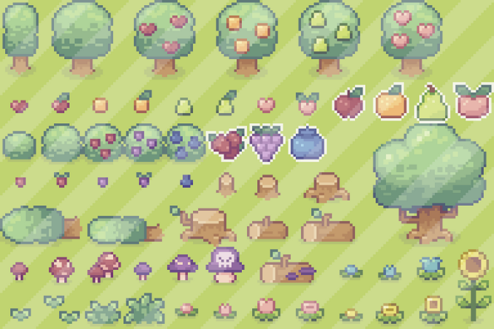
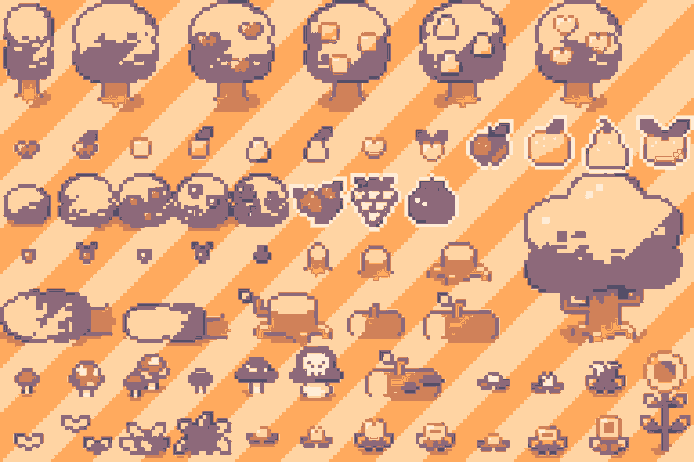
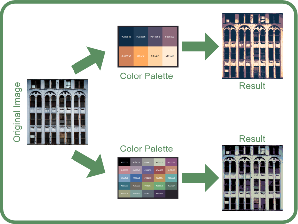

# LESSCOLORS
LESSCOLORS is a tool designed to reduce the number of colors in an image.  
It accomplishes this by identifying the closest color on a specified color palette and replacing the original colors pixel by pixel.  
It is available both as a command-line application (runnable JAR) and as a Java library.  
<br>
*For the color-aware individuals and for other Tetts and cats: It utilizes the LAB color-space to find the best fitting replacement color.*  
<br>
**Warning for gamedevs:** This tool is not intended for real-time scenarios.

# Use-Cases
There's probably more use cases than these, but to give you an impression of what it can do, let's check some out.

## Game Assets
Bring textures or other game related graphics assets to match your personal game style (e.g. your color palette).
### Your game
Let's say your game looks like this:  

### The color palette you used
It looks great and consistent because it only uses colors from your color palette.  

### Non-matching assets from other sources
Unfortunately, this asset pack you found on [insert market place here] and you always wanted to integrate into the game, does not match your art style.  

### Fix it
That's where this tool comes into action.
```console
java -jar lesscolors.jar --input "badcolors.png" -- palette "mypalette.png" --output "nicecolors.png"
```
Et voilà:  


## Stylize Textures


## Stylize Familiy Photos (to convince your grandpa of your hacker skills)


# Documentation (CLI App)
| Argument      | Description                                                                 |
|---------------|-----------------------------------------------------------------------------|
| --input       | The path to the image you want to modify.                                   |
| --palette     | The path to the color palette image.                                        |
| --output      | The path to the output file (will be created in the process).               |
| --output-type | [Optional] The output file format, "png", "jpg", etc. The default is "png". |

# Installation
For the cli app it's just a jar. Download [here](https://github.com/Hangman/lesscolors/releases).  
<br>
And here's how to integrate the library in your project via Gradle:  
First make sure you have Jitpack declared as repository in your build.gradle.kts file:
```kotlin
repositories {
    maven("https://jitpack.io")
}
```
Then add lesscolors as a dependency: 
```kotlin
dependencies {
    implementation 'com.github.Hangman:lesscolors:1e4b433725'
}
```
For specific commit versions, branches, or if you want to use Maven, check out lesscolor's [Jitpack page](https://jitpack.io/#Hangman/lesscolors).
